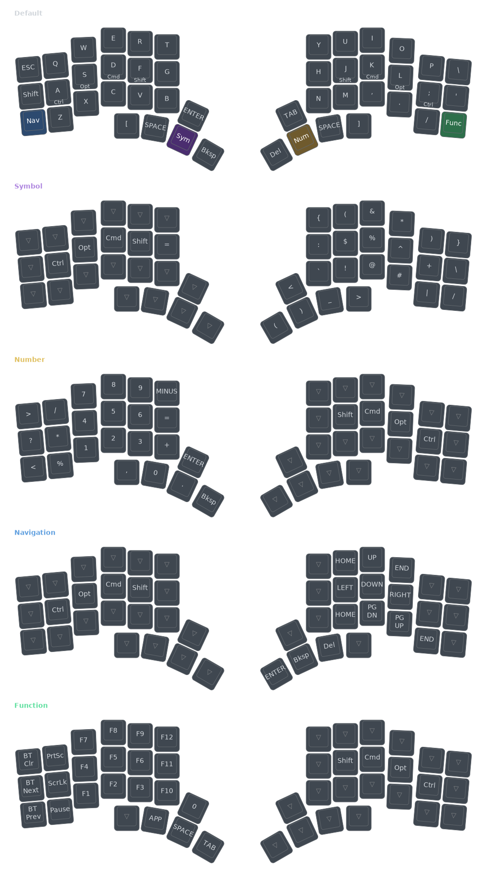

# Forcebe's Hillside View Config

ZMK firmware configuration for the [Hillside View](https://github.com/wannabecoffeenerd/HillSideView/) split keyboard (3x6 layout), running on nice!nano v2 with nice!view displays.

Keymap is based on [Miryoku](https://github.com/manna-harbour/miryoku) with home row mods (Ctrl, Opt, Cmd, Shift).

## Keymap

## Layers

| Layer | Description |
|-------|-------------|
| Default | QWERTY with home row mods (Ctrl, Opt, Cmd, Shift) |
| Sym. | Symbols and brackets |
| Num. | Numpad and arithmetic |
| Nav. | Arrow keys, Home/End, Page Up/Down |
| Func. | Function keys, Bluetooth controls |

## Building

Firmware is built automatically via GitHub Actions on push. Download the artifacts from the [Actions tab](../../actions).

The keymap visualization above is also auto-generated when the keymap changes.
